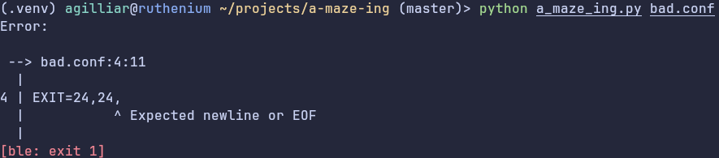

# Description
A-maze-ing consists of making a maze generator, with a pattern in the middle, and visualiser, which outputs to a file in a specific format.
The project is configured through a config format whose format is specified in the [Configuration](#Configuration)

# Overview

## Features:

- Customizeable looks for the visualizer!
- Fancy error reporting
- Animations, colors, and scrolling for large mazes
- Flexible displaying, using adaptive layouts
- 🚀 Blazingly slow 🚀 thanks to python limitations
- No runtime dependencies

## Showcase




# Instructions

To install or run the library, do the following:

## (Optional) Entering a venv

Running 
```bash
make venv-bash
```
will enter a venv in `.venv`, opening bash

## Installing

Before building or running, run
```bash
make install
```
to install dependencies.

## Building

To build the module for distribution, simply run
```bash
make build
```
which will create the binary and source archives.

## Running

Running the program is simple:
```bash
python3 a_maze_ing.py # <your config file here>
```
(configuration file details is specified in [Configuration](#Configuration))

# Configuration


## General structure

The configuration format is reasonably flexible and customiseable.
It is composed of a sequence of lines, each with a field name, followed by an equal sign, then a field value.
Newlines are significant, but empty lines are allowed, and other whitespace may be inserted anywhere.

We distinguish the following different kinds of field:
- <a id="integer"></a>An (unsigned) integer
- <a id="boolean"></a>A boolean: `True` or `False`
- <a id="optional"></a>An optional field: a field whose value will be given a default if not provided
- <a id="path"></a>A filesystem path, one or more of any character except a newline
- <a id="coordinate"></a>A coordinate: pair of [integers](#integer) separated by a comma
- <a id="color"></a>A color: either a comma-separated triplet of [integers](#integer), or a color name, that is one of (`BLACK`, `BLUE`, `CYAN`, `GREEN`, `MAGENTA`, `RED`, `WHITE`, `YELLOW`)
- <a id="color-prefix"></a>A color prefix: two [colors](#color), surrounded by braces (`{`, `}`), and separated by a colon (`:`), respectively foreground and background
- <a id="colored-line"></a>A colored line: a quoted (`"`) single-line strings, with the characters `\`, `{`, `}`, `"`, escaped through a preceeding `\`. The string itself comprises zero or more groups of a [color prefix](#color-prefix) followed by the characters this prefix applies to.
- <a id="list"></a>A list of elements: multiple instances of the same field declaration concatenated to a list
- <a id="grouped-list"></a>A grouped list: a [list](#list) of [integers](#integer) ([optional](#optional), defaulted to `0`)-prefixed-fields, each integer corresponds to a sublist each definition goes to
- <a id="tilemap"></a>A tilemap: a [list](#list) of [colored lines](#colored-line)
- <a id="grouped-tilemap"></a>A grouped tilemap: a [grouped list](#grouped-list) of [colored lines](#colored-line)
- <a id="pattern-string"></a>A pattern string: a quoted (`"`) single line string of non-escaped characters
- <a id="pattern"></a>A pattern: a [list](#list) of [pattern strings](#pattern-string)


## Field list

The following fields exist:

- WITH, [integer](#integer): the width of the maze
- HEIGHT, [integer](#integer): the height of the maze
- ENTRY, [coordinate](#coordinate) ([optional](#optional)): the entry cell of the maze
- EXIT, [coordinate](#coordinate) ([optional](#optional)): the exit cell of the maze
- OUTPUT\_FILE: [path](#path): the file to output the finished maze to
- PERFECT: [boolean](#boolean) ([optional](#optional), defaults to `False`): whether to make the maze perfect or not
- SEED, [integer](#integer) ([optional](#optional)): the seed to use for the maze
- SCREENSAVER, [boolean](#boolean): whether to continuously modify the maze by making it perfect then imperfect, automatically enables [visual](#visual)
- <a id="visual"></a>VISUAL, [boolean](#boolean) ([optional](#optional), defaults to `False`): Whether to enable the visualiser, only works on supported terminals
- TILEMAP\_WALL\_SIZE, [coordinate](#coordinate) ([optional](#optional)): The thickness of the walls, in the tilemaps
- TILEMAP\_CELL\_SIZE, [coordinate](#coordinate) ([optional](#optional)): The size of the inner cell, in the tilemaps
- TILEMAP\_FULL, [grouped tilemap](#grouped-tilemap) ([optional](#optional)): The tilemap to mark the filled tiles
- TILEMAP\_EMPTY, [grouped tilemap](#grouped-tilemap) ([optional](#optional)): The tilemap to mark the empty tiles
- TILEMAP\_PATH, [grouped tilemap](#grouped-tilemap) ([optional](#optional)): The tilemap to mark the path tiles
- TILEMAP\_ENTRY, [grouped tilemap](#grouped-tilemap) ([optional](#optional)): The tilemap to mark the entry tile
- TILEMAP\_EXIT, [grouped tilemap](#grouped-tilemap) ([optional](#optional)): The tilemap to mark the exit tile
- TILEMAP\_BACKGROUND\_SIZE, [coordinate](#coordinate) ([optional](#optional)): The size of the tiling background pattern
- TILEMAP\_BACKGROUND, [grouped tilemap](#grouped-tilemap) ([optional](#optional)): The tiling background pattern repeated to fill space in the layout
- TILEMAP\_BOX\_SIZE, [coordinate](#coordinate) ([optional](#optional)): the size of the corners of the box tilemap
- <a id="bridge-size"></a>TILEMAP\_BOX\_BRIDGE\_SIZE, [coordinate](#coordinate) ([optional](#optional)): the widths of the walls of the box tilemap
- TILEMAP\_BOX, [tilemap](#tilemap) ([optional](#optional)): The tilemap of the box borders, the format is a 2x2 grid of boxes, with every box size zero except the top left one with size [bridge size](#bridge-size)
- PROMPT\_SIZE, [coordinate](#coordinate) ([optional](#optional)): the size of the prompt tile
- PROMPT, [tilemap](#tilemap): the prompt drawn at the bottom of the screen for instructions
- MAZE\_PATTERN, [pattern](#pattern)([optional](#optional)): Each non-space character in the pattern will be a filled cell in the maze, after centering


# Algorithms

The used algorithms for generation were not based on any reference algorithms

## Contour detection perfect mazegen

This algorithm is relatively straight forward:
- Maintain a set of contours of walls, where you can cheaply check if two walls belong to the same contour
- Go through every empty wall of the maze, then:
  - If the neighbours belong to the same contour, go to the next wall, otherwise:
  - Fill the wall and update the contour data structure

The difficult part is the contour structure, our implementation uses [AVL trees](#avl-tree), which allow us to lookup which root a wall belongs to, to easily check contour appartenance, as well as concatenation and splitting in logarithmic time.
We maintain a forest of [AVL Trees](#avl-tree), mapping each wall to a contour, and use the tree order as the winding of said contour.
We can then split or merge contours cheaply and maintain the structure even through other modifications

## Impass removal algorithm

This algorithm makes the maze non-perfect, in fact it attemps to make it perfectly cyclic with no impasses, heuristically.
- For every wall that may be removed, check whether one of its sides only has one exit, if it does, two cases:
  - This wall is a "leaf" wall, that is at least on one side connection it has no neighbour walls, in which case, move it randomly to one of those empty slots
  - This wall is not a "leaf" wall, simply remove it
- Repeat enough times or until a maximum iteration count is reached
This will remove trivial impasses and anneal away most of the ones caused by walls that may not be removed.
Optimization steps may be taken to track "dirty" walls, avoiding to scan the whole maze every time


## A* pathfinding

This simple pathfinding algorithm was used for its adequate speed, see [this resource](#astar) for details

## Motivations

Those algorithms were designed or chosen because we have attempted to make the algorithm mostly realtime-friendly, by avoiding amortized costs in exchange of slower but more consistant approaches. This allows large mazes to be generated without large waiting periods, except for certain unavoidable python issues such as GC with a vast amount of cyclic objects


# Resources
- <a id="avl-tree"></a>[The wikipedia entry on AVL trees](https://en.wikipedia.org/wiki/AVL_tree)
- [A simple overview of curses in python](https://docs.python.org/3/library/curses.html#module-curses) and [the python curses documentation](https://docs.python.org/3/howto/curses.html)
- [The wikipedia entry on quadtrees](https://en.wikipedia.org/wiki/Quadtree) (was not used as a reference, quadtrees are reasonably simple, and our implementation was not based on any other)
- [The nom library](https://github.com/rust-bakery/nom), whose combinatorial parsers we have found to be reasonably transcribable to python, and extremely powerful
- <a id="astar"></a>[The wikipedia entry on A* pathfinding](https://en.wikipedia.org/wiki/A*_search_algorithm)

Very little LLM assistance has been utilized, an attempt was made to use them to find an appropriate pathfinding algorithm for realtime problems with good asymptotic costs, but it has been less than helpful, making up algorithms and sources, constantly shifting what it is explaining, instead of pointing to the fact no practical algorithm is widely known.

# Contributions

## luflores:

- File output
- Code quality contributions
- Reviews
- Simple reference imentations, helpful in debugging and validating functionality
- Build system choices and source

## agilliar:

- Visualiser
- Complex config parser
- Maze algorithms
- Current build system
- This documentation

# Retrospect

The project has generally been overly complex, certain approaches abandonned for the sake of time, notably shortest path pruning through subcountour bounding volume higherarchies, for which stubs can be found in the AVL implementation.

Although a lot of code is present, it should be noted that said code achieves a lot of features and through that lens, the complexity is somewhat justified.
Some things might be better refactored but the current state of the project is workable-enough for use, and spending more time on this might be excessive.

Feature creep might generally be considered an issue, and we have definitely gone through our fair share, but as an approach to learning it managed to make a fairly simple project very enriching.
